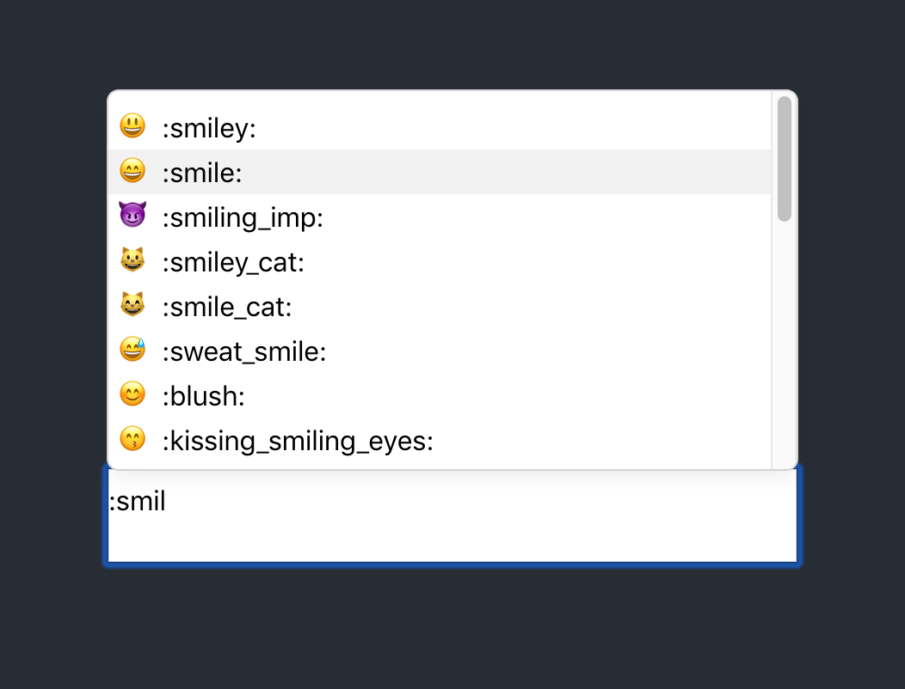

# Emoji Codes

A React component to quickly add emojis to text fields using emoji codes, intended for use as a Chrome extension for Facebook Messenger. It looks and behaves similarly to the emoji autocomplete menu in Slack.

The component listens for changes on an editable `
`. When a <kbd>:</kbd> and some letters matching to an emoji code are typed in the field, the autocomplete menu will appear. An emoji can be selected by clicking on it or by using <kbd>↑</kbd> and <kbd>↓</kbd> to navigate and pressing <kbd>Enter</kbd> or <kbd>Tab</kbd>. The menu can be dismissed with the <kbd>Esc</kbd> key. Emoji lookup is powered by [`emoji-mart-lite`](https://github.com/vaskevich/emoji-mart-lite).
